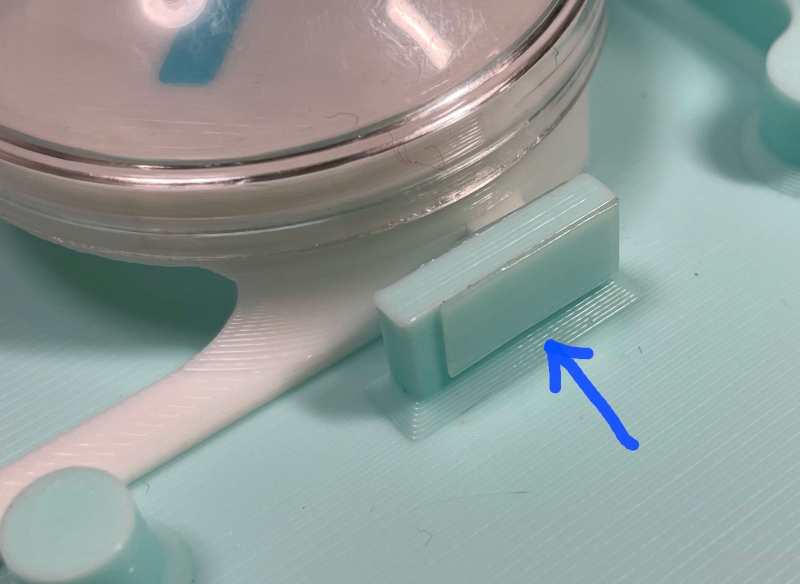

# Diva Pico - Project Diva Style Mini Controller
[点这里可以切换到中文版](README_CN.md)

Features:
* It's small, but the buttons are still decent.
* Works as a Nintendo Switch controller.
* 16 slider keys.
* Command line of rich features.
* All source files open.

Thanks to many respectful guys/companies who made their tools or materials free or open source (KiCad, OnShape, InkScape, Raspberry things).

Special thanks to community developers that inspired me and helped me: CrazyRedMachine (https://github.com/CrazyRedMachine).

And also:
* RP_Silicon_KiCad: https://github.com/HeadBoffin/RP_Silicon_KiCad
* Switch_Keyboard_Kailh: https://github.com/kiswitch/keyswitch-kicad-library

## Notes
This Diva Pico project:  
* Heavily depends on 3D printing, you need a Bambu 3D printer (X1, P1 or A1, not the mini version).
* Requires skills to solder tiny components.
## My Other Projects
You can check out my other cool projects.

           

* Popn Pico: https://github.com/whowechina/popn_pico
* IIDX Pico: https://github.com/whowechina/iidx_pico
* IIDX Teeny: https://github.com/whowechina/iidx_teeny
* Chu Pico: https://github.com/whowechina/chu_pico
* Mai Pico: https://github.com/whowechina/mai_pico
* Diva Pico: https://github.com/whowechina/diva_pico
* AIC Pico: https://github.com/whowechina/aic_pico
* Groove Pico: https://github.com/whowechina/groove_pico
* Geki Pico: https://github.com/whowechina/geki_pico
* Musec Pico: https://github.com/whowechina/musec_pico
* Ju Pico: https://github.com/whowechina/ju_pico

## **Disclaimer** ##
I made this project in my personal time with no financial benefit or sponsorship. I will continue to improve the project. I have done my best to ensure that everything is accurate and functional, there's always a chance that mistakes may occur. I cannot be held responsible for any loss of your time or money that may result from using this open source project. Thank you for your understanding.

## About the License
It's CC-NC. So DIY for yourself and for your friend, don't make money from it. And plagiarism that doesn’t even dare to mention the original author is not acceptable. Plase note that pooling orders and group buying for raw materials is acceptable. Selling off any leftover components without profit is also acceptable.

If you're interested in some kind of commercial use, please contact me (Discord, QQ group, Wechat group or leave your contact in issue section).

## My Discord Invitation
https://discord.gg/M8f2PPQFEA

## HOW TO BUILD
### Frequently Made Mistakes
Many DIY enthusiasts commonly make certain mistakes during the building process. Please proceed with extra caution to avoid these.
* **MISTAKE: Soldering everything together without conducting intermediate testing.**  
  Remember, even professional engineers can make mistakes. It becomes significantly harder to identify the root cause of a problem when all components are already assembled or soldered. Therefore, it's advisable to solder and test in stages. The firmware is designed to function correctly even with some components missing, which is good for testing.
* **MISTAKE: Neglecting to cut the ADDR pin trace on the MPR121 module.**  
  The MPR121 module in the market has the ADDR pin pre-connected to ground. But the board expects a floating ADDR pin, otherwise the ADDR pin will short the circuit. Please verify your "CUT" using a multimeter.
* **MISTAKE: Rushing to replace components when something fails.**  
  Sometimes people prematurely assumes that the Raspberry Pi Pico or other modules are faulty.
  Be aware that desoldering and soldering large SMD components is a challenging task. It carries the risk of damaging the component or the PCB board. Patience and caution are crucial. Look at the schematics and PCB design files and ask help from community first. Questioning the integrity of these components should be your last resort.

### PCB
* Choose a PCB vendor (such as JLCPCB) and place an order with the gerber zip file (latest `Production\PCB\diva_main_xxx.zip`), regular FR-4 board, black color, thickness is **1.6mm**.  
  

* 1x Rasberry Pico Pi Pico or pin-to-pin compatible clones.  
  https://www.raspberrypi.com/products/raspberry-pi-pico  
  Sticking a thin scotch tape to avoid short-circuit is a good idea.  
  

* 16x WS2812B-4020 side-facing RGB LEDs for the slider.  
  https://www.lcsc.com/product-detail/Light-Emitting-Diodes-LED_Worldsemi-WS2812B-4020_C965557.html
* 9x WS2812B-3528 RGB LEDs for the buttons.
* 1x 0603 10ohm resistor (R3), or if you feel it's not challenging, go with SN74LV1T34DBVR (SOT-23-5) level shifter (U8), you only need either of them.
  https://www.lcsc.com/product-detail/Buffer-Driver-Transceiver_Texas-Instruments-SN74LV1T34DBVR_C100024.html

* 2x MPR121 modules, there're many types in the market, choose ones like this.  
  https://www.sparkfun.com/products/retired/9695  
  Before solder MP121 module to the main PCB board, remember to use a knife to **cut (unshort) the tiny trace that connects ADDR to the GND**. Please be careful not to cut more than necessary.  
    

* 8x 0603 1uF (0.1~1uF all fine) capacitors (C1 to C8), OPTIONAL, recommended.

* 4x Kailh choc v1 switches, use heavy linear ones (dark yellow is the best, the force is around 70gf).  
  

* 2x Alps SKSTAAE010 tactile switches.
  https://tech.alpsalpine.com/e/products/detail/SKSTAAE010/

* 1x Omron B3F-4005 or B3F-4000 micro-switch.
  https://www.mouser.com/ProductDetail/Omron-Electronics/B3F-4000?qs=B3tblJ0Nlt8c5sbFRctxww%3D%3D

* 3M 5423 or 5421 UHMW PE film tape, important for button feel. 5423 is better for its thickness.  
  https://www.3m.com/3M/en_US/p/d/b40069119/

  You need to apply tapes to the contact surface of button to switch and button to base clamp.  
  
  
  

* 4x 2mm\*50mm (diameter\*length) steel rods for the button lever structure.

### Light Guide Panel
* Find a service to cut a light guide panel or a frosted acrylic panel. It's a perfect rectangle, the size is 240mm*42mm, 1.8mm to 2.0mm thickness, so you don't need a CAD file.  
  
* This is what a decent light guide panel looks like.  
  

### 3D Printing
* You might need a Bambu 3D printer:
  * Parts are designed to perfectly fit in its 256mm*256mm print bed.
  * Its AMS system works great for multi-color printing.
* Printing parameters  
  * PLA, PETG, ABS are all OK.
  * The color "Arctic Whisper" works best for the main body.
  * Layer height: 0.2mm
  * Support: Yes, always.

* Base: `Production\3D\diva_pico_base.stl`.
* Cover Base: `Production\3D\diva_pico_support.stl`.
* Cover: `Production\3D\diva_pico_panel.3mf`, with multi-color support.
* Buttons: `Production\3D\diva_pico_button_combo.3mf`, with multi-color support.  
  Note that button components (the button body, the seat and the logos on it) are mixed in one file, you need to cherry-pick before printing.  
  

From top to bottom:
* Cover
* Cover Base + Light Guide Panel
* Buttons
* PCB
* Base

You need **6x M3*10mm regular screws** to fix all things.

6x silicone anti-slip pads can be applied to the bottom side of the base to provide stability when playing.  

#### Button dome choices
* Go buy this 60mm dome buttons with 48mm diameter dome. I found this one is perfect, its inner diameter is 46mm. You need to print the buttons according to what dome you get.  
  

### Firmware
* UF2 file is in `Production\Firmware` folder.
* For the new build, hold the BOOTSEL button while connect the USB to a PC, there will be a disk named "RPI-RP2" showed up. Drag the UF2 firmware binary file into it. That's it. There's a small hole at the bottom side of the Diva Pico, it is facing right to the BOOTSEL button.
* It has a command line to do configuration. You can use this Web Serial Terminal to connect to the USB serial port of the Diva Pico. (Note: "?" is for help)  
  https://googlechromelabs.github.io/serial-terminal/  

## CAD Source File
I'm using OnShape free subscription. It's powerful but it can't archive original designs to local, so I can only share the link here. STL/DXF/DWG files are exported from this online document.  
https://cad.onshape.com/documents/d9e9c1de2d4b98d5eaf21d07/w/7c216f367b558e083eb1f468/e/4536bf9859137db81313ff87?configuration=List_ilV09d08Sdz7FZ%3DButton_48&renderMode=0&uiState=65923e1383b3106c15b5c996
