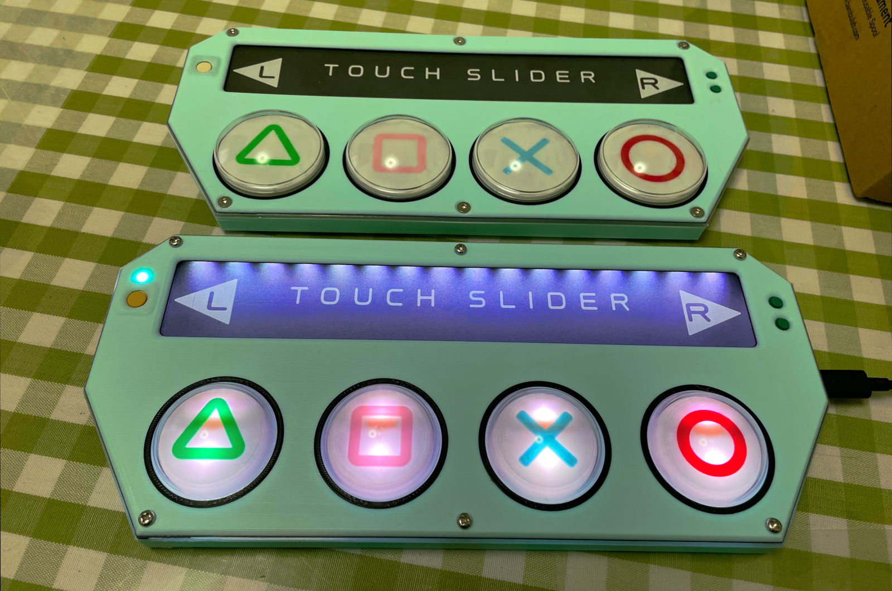
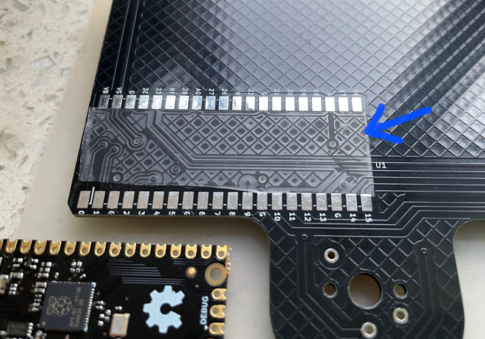
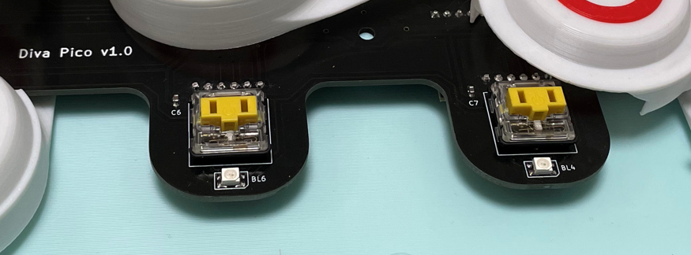
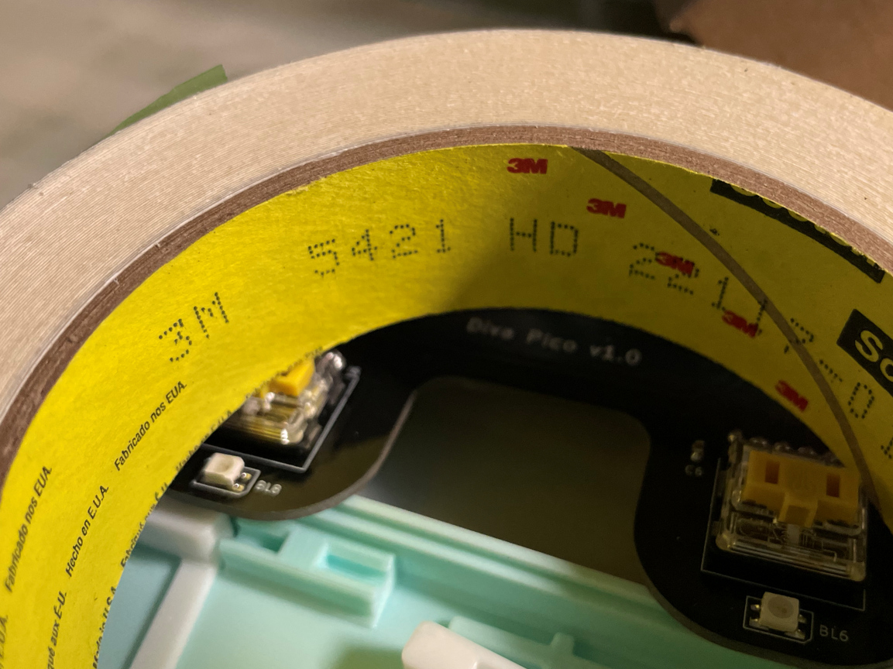
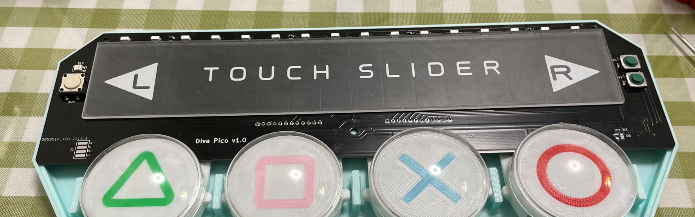

# Diva Pico - Project Diva （初音未来：歌姬计划）计划风格的迷你控制器
[Click here for the English version of this guide.](README.md)

**特点：**
* 他很小巧，但按钮手感非常好。
* 可以作为任天堂 Switch 游戏机的控制器。
* 16个滑条按键。
* 丰富的命令行功能。
* 所有源文件开放。

感谢许多尊敬的爱好者和公司将他们的工具或材料免费或开源（KiCad，OnShape，InkScape，Raspberry 相关工具, 嘉立创）。

特别感谢社区开发者的启发和帮助：比如 CrazyRedMachine (https://github.com/CrazyRedMachine).

还有：
* RP_Silicon_KiCad: https://github.com/HeadBoffin/RP_Silicon_KiCad
* Switch_Keyboard_Kailh: https://github.com/kiswitch/keyswitch-kicad-library

## 说明
这个项目：
* 高度依赖 3D 打印，你需要一个 Bambu 3D 打印机（X1, P1 或 A1，不是迷你版）。
* 需要焊接微小的元件的技能。

## 其他项目
你也可以查看我其他的酷炫项目。

           

* Popn Pico: https://github.com/whowechina/popn_pico
* IIDX Pico: https://github.com/whowechina/iidx_pico
* IIDX Teeny: https://github.com/whowechina/iidx_teeny
* Chu Pico: https://github.com/whowechina/chu_pico
* Mai Pico: https://github.com/whowechina/mai_pico
* Diva Pico: https://github.com/whowechina/diva_pico
* AIC Pico: https://github.com/whowechina/aic_pico
* Groove Pico: https://github.com/whowechina/groove_pico
* Geki Pico: https://github.com/whowechina/geki_pico
* Musec Pico: https://github.com/whowechina/musec_pico
* Ju Pico: https://github.com/whowechina/ju_pico

## **声明** ##
我在个人时间内制作了这个项目，没有任何经济利益或赞助。我将继续改进这个项目。我已尽我所能确保所有内容的准确性和功能性，但总有可能出现错误。如果你因使用这个开源项目而造成时间或金钱的损失，我不能负责。感谢你的理解。

## 关于许可证
它是 CC-NC 授权。所以你只能给自己和你的朋友 DIY，不能利用这个项目赚钱，比如收费的代做，出售整机等，连源作者都不敢提的抄袭或者稍微改改换个名字来打擦边球就更不可以了。注意团购和拼单订购原始元器件是合理的，非盈利的方式卖掉剩余的元器件也是可以接受的。

如果希望商用授权或者购买成品（可能较慢），请联系我（Discord，QQ 群，微信群或者在 issue 区留下你的联系方式）。

## 我的 Discord 服务器邀请
https://discord.gg/M8f2PPQFEA

## 如何制作
### 常见错误
很多 DIY 爱好者在制作过程中常常犯一些错误。请格外小心避免这些错误。
* **错误：在焊接之前没有进行中间测试。**  
  请记住，即使是专业工程师也会犯错误。当所有元件都已组装或焊接时，要找到问题的根本原因就会变得更加困难。因此，建议分阶段焊接和测试。固件设计为即使有一些元件缺失也能正确运行，这对测试很有帮助。
* **错误：忘记切断 MPR121 模块上的 ADDR 引脚的默认接地。**  
  市面上的 MPR121 模块的 ADDR 引脚默认已经接地。但是，板子上的设计需要一个浮动的 ADDR 引脚，否则 ADDR 引脚会短路。请使用万用表验证确保你成功切断它，但也请注意不要切过头，导致切断临近线路。
* **错误：在器件看上去没有工作的时候就匆忙更换它。**  
  比如过早的假设 Raspberry Pi Pico 或其他模块是有问题的。
  请记住，器件绝大部分情况下都是好的，问题可能在焊接上。更换器件会带来额外的风险，比如损坏器件或 PCB 板。耐心和谨慎是至关重要的。首先查看原理图和 PCB 设计文件，并向社区寻求帮助。怀疑器件问题应该是你的最后选择。

### PCB
* 找个 PCB 供应商（比如 JLCPCB）下单，使用最新的 `Production\PCB\diva_main_xxx.zip` 文件，选择常规 FR-4 板材，黑色，厚度为 **1.6mm**。  
  
* 1x 树莓派 Pico 或兼容的克隆板。  
  https://www.raspberrypi.com/products/raspberry-pi-pico  
  在接触点附近贴上一层薄薄的透明胶带以避免短路。  
  
* 16x WS2812B-4020 侧向发光 RGB LED 用于滑条。  
  https://www.lcsc.com/product-detail/Light-Emitting-Diodes-LED_Worldsemi-WS2812B-4020_C965557.html
* 9x WS2812B-3528 RGB LED 用于按钮。
* 1x 0603 10 欧姆电阻（R3），或者如果你嫌它太简单了，可以使用 SN74LV1T34DBVR（SOT-23-5）电平转换器（U8）来代替。  
  https://www.lcsc.com/product-detail/Buffer-Driver-Transceiver_Texas-Instruments-SN74LV1T34DBVR_C100024.html
* 2x MPR121 模块，市面上有很多种，选择这种类型的。  
  https://www.sparkfun.com/products/retired/9695  
  在焊接 MPR121 模块到主 PCB 板之前，记得用小刀**切断 ADDR 和 GND 之间的微小连线**，注意绝对不要切过头。  
  

* 8x 0603 1uF（0.1~1uF 都可以）电容（C1 到 C8），可选，但建议焊上。
* 4x Kailh choc v1 机械轴，建议使用重线性轴（深黄色最好的，按压力约为 70gf）。
  
* 2x Alps SKSTAAE010 轻触开关。  
  https://tech.alpsalpine.com/e/products/detail/SKSTAAE010/

* 1x Omron B3F-4005 或 B3F-4000 微动开关。  
  https://www.mouser.com/ProductDetail/Omron-Electronics/B3F-4000?qs=B3tblJ0Nlt8c5sbFRctxww%3D%3D

* 3M 5423 或 5421 UHMW PE 薄膜胶带，对于按钮手感很重要。5423 更厚一些。  
  https://www.3m.com/3M/en_US/p/d/b40069119/

  你需要将胶带贴在按钮到开关的接触面和按钮到底座夹紧处。  
  
  
  

### 导光板
* 找一个服务切割导光板或者磨砂亚克力板。它是一个完美的矩形，尺寸是 240mm*42mm，厚度为 1.8mm 到 2.0mm，所以你不需要 CAD 文件。  
  
* 一个好的导光板看上去是这样的。  
  

### 3D 打印
* 你可能需要一个 Bambu 3D 打印机：
  * 部件都是为了完美适配 256mm*256mm 的打印床。
  * 它的 AMS 系统非常适合多色打印。
* 打印参数
  * PLA, PETG, ABS 都可以。
  * "Arctic Whisper" 颜色最适合主体。
  * 打印层高：0.2mm
  * 支撑：需要。

* 主体：`Production\3D\diva_pico_base.stl`。
* 盖子底座：`Production\3D\diva_pico_cover_base.stl`。
* 盖子：`Production\3D\diva_pico_cover.3mf`，支持多色打印。
* 按钮：`Production\3D\diva_pico_buttons_*_*.3mf`，支持多色打印。  
  注意，组件（按钮主体，按钮座和上面的图案）都混在一个文件里，你需要在打印前挑选。举例说，你需要在这个文件里选择 FixedButton，一种按钮座和一种图案来一次性打印："diva_pico_buttons_fixed_48.3mf"。  
  

  你有两种选择的铰链，一种是固定铰链，另一种是旋转铰链。旋转铰链的手感更好，但装配稍微麻烦一些。  
  
  

从上到下：
* 盖子
* 盖子底座 + 导光板
* 按钮
* PCB
* 主体

你需要 **6x M3*10mm 普通螺丝** 来固定所有东西。

6x 硅胶防滑垫可以贴在底座的底部，以提供游玩时的稳定性。

#### 按钮圆顶选择
* 淘宝找个服务，他们可以根据你的尺寸要求吹制亚克力圆顶。完美的尺寸是：外径 42mm，外高 18mm，2mm 透明亚克力，无帽檐。这种方案下，你需要打印 42mm 的按钮。  
  
* 或者购买现成的 60mm 的圆顶游戏机按钮，内径 46mm（左边的那个）。另一种类型的圆顶按钮太高，内径 45mm（右边的那个）。你需要根据你购买的圆顶按钮来打印按钮。  
  

### 固件
* 使用最新的 UF2 文件，它在 `Production\Firmware` 文件夹里。
* 全新烧录的话，按住 BOOTSEL 按钮，然后连接 USB 到 PC，会出现一个名为 "RPI-RP2" 的磁盘。将 UF2 固件拖入即可。Divia Pico 的底部有一个小孔，它正对着 BOOTSEL 按钮。
* 固件提供了命令行配置功能，你可以使用这个 Web Serial Terminal 来连接 Diva Pico 的 USB 串口。（提示：输入 "?" 可以获得帮助）  
  https://googlechromelabs.github.io/serial-terminal/

## CAD 源文件
我使用 OnShape 免费订阅。它很强大，但不能将原始设计存档到本地，所以我只能在这里分享链接。STL/DXF/DWG 文件是从这个在线文档导出的。  
https://cad.onshape.com/documents/d9e9c1de2d4b98d5eaf21d07/w/7c216f367b558e083eb1f468/e/4536bf9859137db81313ff87?configuration=List_ilV09d08Sdz7FZ%3DButton_48&renderMode=0&uiState=65923e1383b3106c15b5c996
